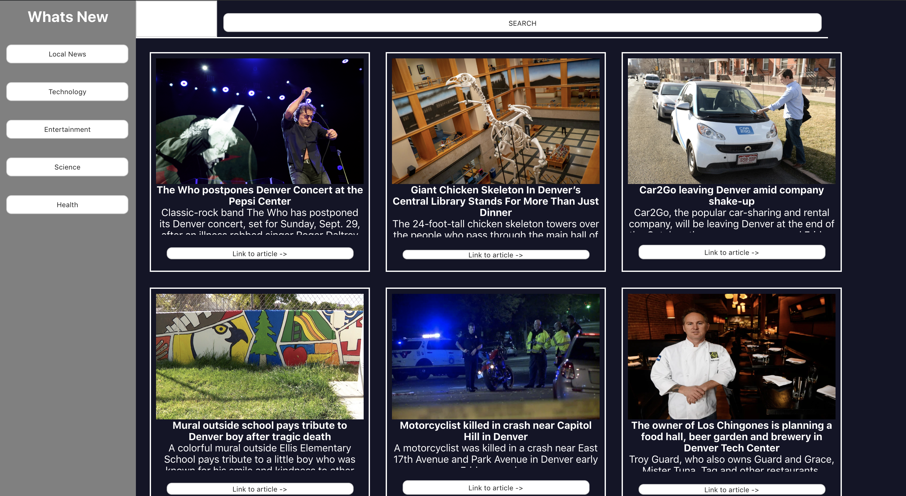

# Whats New - Turing Mod 3 Project

The first project I've worked on using React to build my app. It is meant to be able to filter between the different news articles by utilizing state.

## How it works

Upon visiting the site the home page will display local news articles. A user can click any of the different categories on the left side to filter articles by that category.

## Technologies used

- eslint
- npm
- jest
- enzyme
- ES6 javascript

## Challenges

Familiarizing myself with React was exciting, getting used to new technologies and frameworks is always a challenge though. Also taking the first steps to learn how to implement testing using jest and enzyme was difficult but worth it.

## Future Iterations

In the future I would like to build functionality into the search bar that would allow it to sift through the current display of articles on the page. There is also an opportunity to switch the data to an API and use fetch to acquire it.

## Author

- Tristan Holtz https://github.com/Tristan-Holtz
